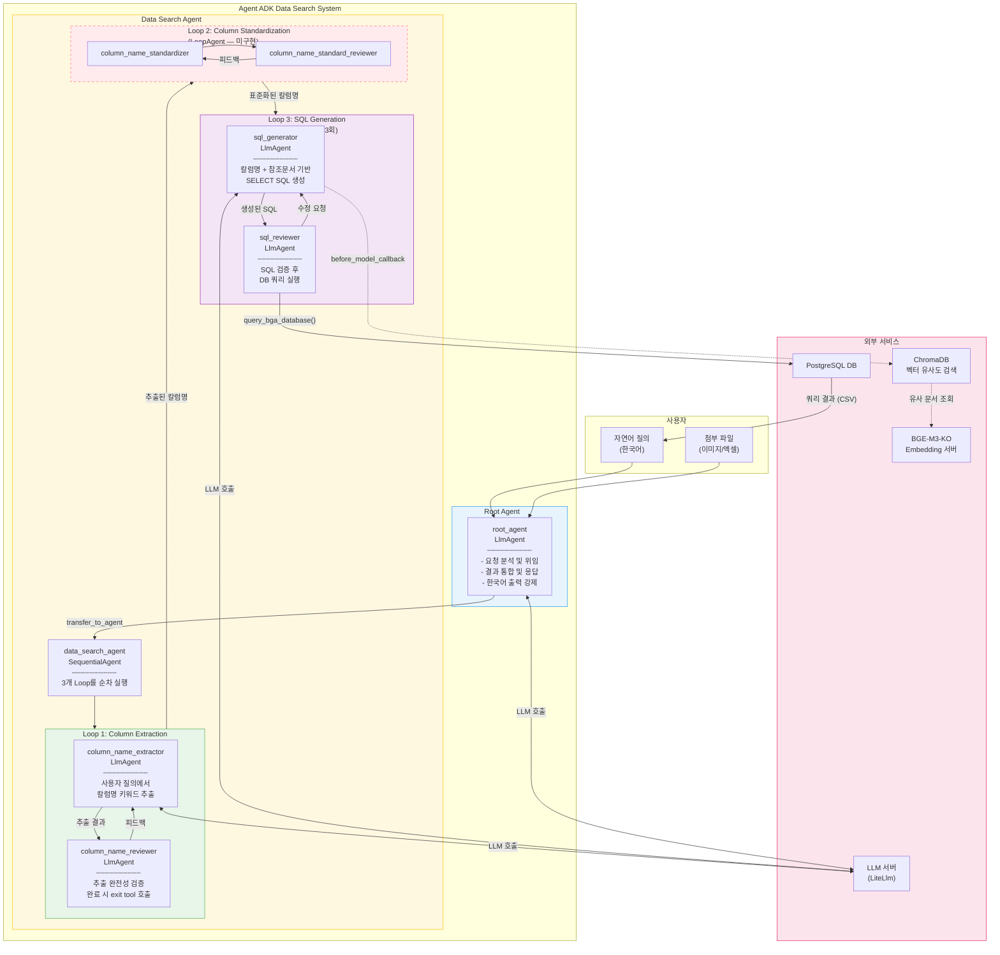
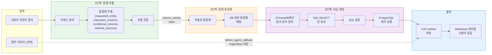
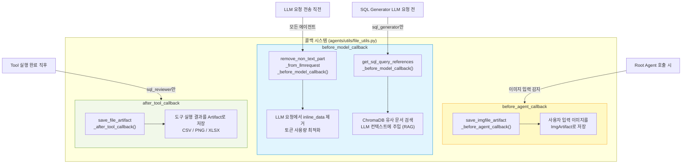
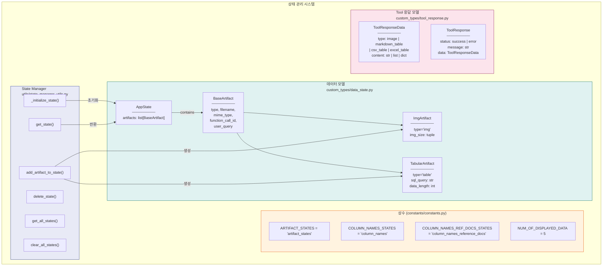
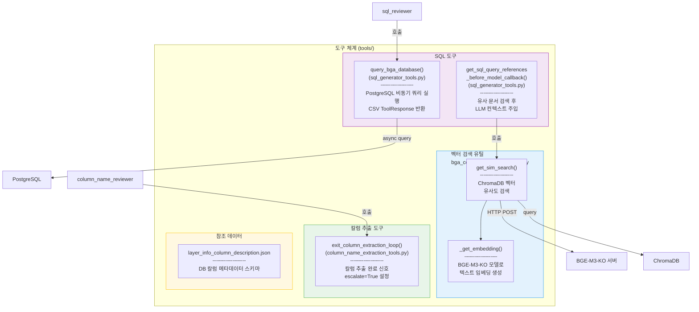
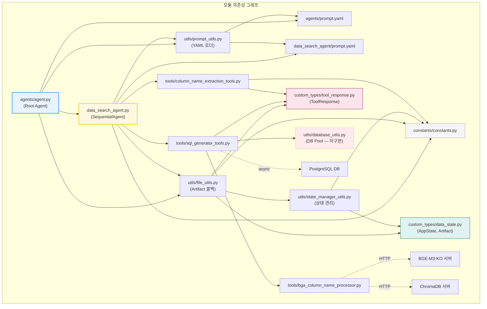

# Agent ADK Data Search - System Architecture

> **Framework**: Google Agent Development Kit (ADK)
> **목적**: 자연어 질의 → SQL 생성 → DB 조회 자동화 시스템
> **언어**: Python 3.12

---

## 목차

1. [전체 시스템 구조](#1-전체-시스템-구조)
2. [데이터 흐름](#2-데이터-흐름)
3. [콜백 시스템](#3-콜백-시스템)
4. [상태 관리](#4-상태-관리)
5. [도구 체계](#5-도구-체계)
6. [모듈 의존성](#6-모듈-의존성)
7. [디렉토리 구조](#7-디렉토리-구조)
8. [파일별 상세 설명](#8-파일별-상세-설명)
9. [기술 스택](#9-기술-스택)

---

## 1. 전체 시스템 구조

사용자가 한국어 자연어로 데이터를 요청하면, **Root Agent**가 요청을 분석하여 **Data Search Agent**(SequentialAgent)에 위임합니다. Data Search Agent는 3개의 **LoopAgent**를 순차 실행하여 칼럼 추출 → 칼럼 표준화 → SQL 생성/실행을 수행합니다.



> **참고**: Loop 2 (Column Standardization)는 현재 코드에서 참조되지만 아직 구현되지 않았습니다 (점선 표시).

---

## 2. 데이터 흐름

사용자 입력부터 최종 응답까지의 전체 데이터 파이프라인입니다.



### 단계별 설명

| 단계 | Agent | 핵심 동작 | 출력 |
|------|-------|-----------|------|
| **1. 칼럼 추출** | `column_name_extractor` + `reviewer` | 자연어에서 요청 엔티티, 칼럼, 조건 칼럼, 추론 칼럼 추출 | `column_names` state |
| **2. 칼럼 표준화** | (미구현) | 추출된 키워드를 실제 DB 칼럼명으로 매핑 | 표준화된 칼럼명 |
| **3. SQL 생성** | `sql_generator` + `reviewer` | RAG 참조문서 기반 SQL 생성 → 검증 → PostgreSQL 실행 | CSV Artifact + Markdown 테이블 |

---

## 3. 콜백 시스템

Google ADK의 콜백 훅을 활용하여 에이전트 실행 전후에 데이터를 가공합니다. 모든 콜백은 `agents/utils/file_utils.py`에 정의되어 있습니다.



### 콜백 상세

| 콜백 종류 | 함수명 | 트리거 시점 | 역할 |
|-----------|--------|-------------|------|
| `before_agent` | `save_imgfile_artifact_before_agent_callback()` | Root Agent 호출 시 | 사용자 입력 이미지를 `ImgArtifact`로 저장 |
| `before_model` | `remove_non_text_part_from_llmrequest_before_model_callback()` | 모든 LLM 요청 전 | inline_data 제거하여 토큰 절약 |
| `before_model` | `get_sql_query_references_before_model_callback()` | SQL Generator LLM 요청 전 | ChromaDB에서 유사 문서 검색 후 컨텍스트 주입 |
| `after_tool` | `save_file_artifact_after_tool_callback()` | Tool 실행 완료 후 | CSV/PNG/XLSX 결과를 Artifact로 저장 |

---

## 4. 상태 관리

`invocation_id` 기반의 상태 관리 시스템으로, 각 요청 세션마다 독립적인 Artifact 목록을 유지합니다.



### State 키 설명

| State 키 | 타입 | 용도 |
|-----------|------|------|
| `artifact_states` | `AppState` | 현재 세션의 Artifact 목록 (이미지, 테이블) |
| `column_names` | `str` | 추출된 BGA 칼럼명 목록 |
| `column_names_reference_docs` | `str` | ChromaDB에서 검색된 참조 문서 |

---

## 5. 도구 체계

에이전트가 사용하는 도구(Tool)들의 구조입니다. `sub_agents/data_search_agent/tools/` 디렉토리에 위치합니다.



### 도구 상세

| 도구 | 파일 | 호출 에이전트 | 역할 |
|------|------|---------------|------|
| `exit_column_extraction_loop()` | `column_name_extraction_tools.py` | `column_name_reviewer` | 칼럼 추출 루프 종료 신호 (escalate=True) |
| `query_bga_database()` | `sql_generator_tools.py` | `sql_reviewer` | PostgreSQL 비동기 쿼리 실행, CSV 반환 |
| `get_sql_query_references_before_model_callback()` | `sql_generator_tools.py` | `sql_generator` (before_model) | ChromaDB RAG 검색 후 컨텍스트 주입 |
| `_get_embedding()` | `bga_column_name_processor.py` | (내부 함수) | BGE-M3-KO 모델로 텍스트 벡터화 |
| `get_sim_search()` | `bga_column_name_processor.py` | `get_sql_query_references` | ChromaDB 유사도 검색 |

---

## 6. 모듈 의존성

모듈 간 import 관계 그래프입니다. 점선은 외부 서비스 연결을 나타냅니다.



---

## 7. 디렉토리 구조

```
agent-adk-data-search/
├── README.md                          # 프로젝트 설명
├── .gitignore                         # Git 무시 규칙
├── .python-version                    # Python 3.12
├── architecture.md                    # 이 파일 (아키텍처 문서)
│
└── agents/
    ├── agent.py                       # Root Agent 정의
    ├── prompt.yaml                    # Root Agent 프롬프트
    │
    ├── constants/
    │   ├── __init__.py                # 상수 export
    │   └── constants.py               # ARTIFACT_STATES, NUM_OF_DISPLAYED_DATA 등
    │
    ├── custom_types/
    │   ├── __init__.py                # 타입 export
    │   ├── data_state.py              # BaseArtifact, ImgArtifact, TabularArtifact, AppState
    │   └── tool_response.py           # ToolResponse, ToolResponseData
    │
    ├── utils/
    │   ├── __init__.py                # 유틸리티 export
    │   ├── file_utils.py              # Artifact 콜백 (364줄, 핵심 모듈)
    │   ├── prompt_utils.py            # YAML 프롬프트 로더
    │   ├── state_manager_utils.py     # invocation_id 기반 상태 관리
    │   ├── database_utils.py          # (빈 파일 — DB Pool 미구현)
    │   ├── log_utils.py               # (빈 파일 — 로깅 미구현)
    │   └── model_communication_utils.py # (빈 파일 — 모델 통신 미구현)
    │
    └── sub_agents/
        ├── __init__.py                # data_search_agent export
        └── data_search_agent/
            ├── __init__.py            # data_search_agent re-export
            ├── data_search_agent.py   # SequentialAgent + 3개 LoopAgent 정의
            ├── prompt.yaml            # 4개 LlmAgent 프롬프트
            ├── sub_agents/
            │   └── __init__.py        # (빈 파일 — 중첩 sub-agent 미구현)
            └── tools/
                ├── column_name_extraction_tools.py  # exit_column_extraction_loop()
                ├── sql_generator_tools.py           # query_bga_database(), RAG callback
                ├── bga_column_name_processor.py      # 벡터 임베딩 + ChromaDB 검색
                └── layer_info_column_description.json # DB 칼럼 메타데이터 스키마
```

> **범례**: `(빈 파일)` = 아직 구현되지 않은 placeholder 파일

---

## 8. 파일별 상세 설명

### 핵심 모듈

| 파일 | 줄 수 | 역할 |
|------|-------|------|
| `agents/agent.py` | 32 | Root Agent 초기화. LiteLlm 모델 설정, `data_search_agent`를 sub-agent로 등록, 콜백 함수 연결 |
| `agents/prompt.yaml` | 31 | Root Agent 프롬프트. 역할 지시, 에러 핸들링, 출력 포맷(Markdown 테이블), 한국어 강제, 시간 조건 규칙 |
| `data_search_agent.py` | 128 | SequentialAgent 정의. Column Extraction Loop → Column Standardization Loop → SQL Generation Loop 3단계 파이프라인 구성 |
| `data_search_agent/prompt.yaml` | 95 | 4개 LlmAgent (extractor, reviewer, sql_generator, sql_reviewer)의 상세 프롬프트 |

### 데이터 모델

| 파일 | 줄 수 | 역할 |
|------|-------|------|
| `custom_types/data_state.py` | 62 | Pydantic 모델: `BaseArtifact`(기본), `ImgArtifact`(이미지), `TabularArtifact`(테이블), `AppState`(상태 컨테이너) |
| `custom_types/tool_response.py` | 39 | `ToolResponse`(status/message/data) 및 `ToolResponseData`(type/content). MCP `CallToolResult` 변환 지원 |

### 유틸리티

| 파일 | 줄 수 | 역할 |
|------|-------|------|
| `utils/file_utils.py` | 364 | 핵심 Artifact 관리: XLSX 파싱, RAG 서버 연동, before/after 콜백 (이미지 저장, inline_data 제거, CSV/PNG/XLSX Artifact 저장) |
| `utils/state_manager_utils.py` | 171 | `invocation_id` 기반 상태 CRUD. `AppState` 초기화/조회/삭제/전체조회/전체삭제 |
| `utils/prompt_utils.py` | 35 | YAML 파일에서 태그 기반으로 프롬프트 로드. 점(`.`) 구분 중첩 태그 지원 |

### 도구

| 파일 | 줄 수 | 역할 |
|------|-------|------|
| `tools/column_name_extraction_tools.py` | 25 | `exit_column_extraction_loop()`: 칼럼 추출 완료 시 `escalate=True`로 루프 탈출 |
| `tools/sql_generator_tools.py` | 80 | `query_bga_database()`: PostgreSQL 비동기 쿼리 실행. `get_sql_query_references_before_model_callback()`: RAG 검색 |
| `tools/bga_column_name_processor.py` | 42 | `_get_embedding()`: BGE-M3-KO 임베딩 생성. `get_sim_search()`: ChromaDB 벡터 유사도 검색 |
| `tools/layer_info_column_description.json` | 27 | DB 칼럼 메타데이터 스키마 (table, column_name, description, data_type, example) |

---

## 9. 기술 스택

| 분류 | 기술 | 용도 |
|------|------|------|
| **언어** | Python 3.12 | 전체 시스템 |
| **에이전트 프레임워크** | Google Agent Development Kit (ADK) | LlmAgent, LoopAgent, SequentialAgent |
| **LLM 연동** | LiteLlm | 다양한 LLM 모델 래퍼 (환경변수로 설정) |
| **데이터베이스** | PostgreSQL | BGA 데이터 저장소 (psycopg async pool) |
| **벡터 DB** | ChromaDB | 칼럼 설명 문서의 벡터 유사도 검색 |
| **임베딩 모델** | BGE-M3-KO | 한국어 텍스트 벡터 변환 |
| **데이터 처리** | Pandas | DataFrame 조작, CSV/XLSX 변환 |
| **직렬화** | Pydantic v2, JSON, YAML | 모델 검증, 상태 직렬화 |
| **비동기** | asyncio | 비동기 DB 쿼리, 비동기 콜백 |
| **프로토콜** | MCP (Model Context Protocol) | 도구 실행 결과 표준 포맷 |

---

## 설계 패턴 요약

| 패턴 | 적용 위치 | 설명 |
|------|-----------|------|
| **계층적 에이전트** | Root → SequentialAgent → LoopAgent | 관심사 분리 및 태스크 위임 |
| **반복 정제 (Loop)** | LoopAgent (max 3회) | 추출/생성 결과를 reviewer가 검증, 실패 시 재시도 |
| **순차 파이프라인** | SequentialAgent | 칼럼 추출 → 표준화 → SQL 생성 순서 보장 |
| **콜백 훅** | before_agent / before_model / after_tool | 에이전트 실행 전후 데이터 가공 |
| **RAG** | ChromaDB + BGE-M3-KO | 유사 문서를 LLM 컨텍스트에 주입하여 SQL 정확도 향상 |
| **Artifact 관리** | AppState + State Manager | 세션별 독립적 결과물 추적 (이미지, 테이블) |
| **표준화된 Tool 응답** | ToolResponse / ToolResponseData | 모든 도구가 동일한 형식으로 결과 반환, MCP 변환 지원 |
