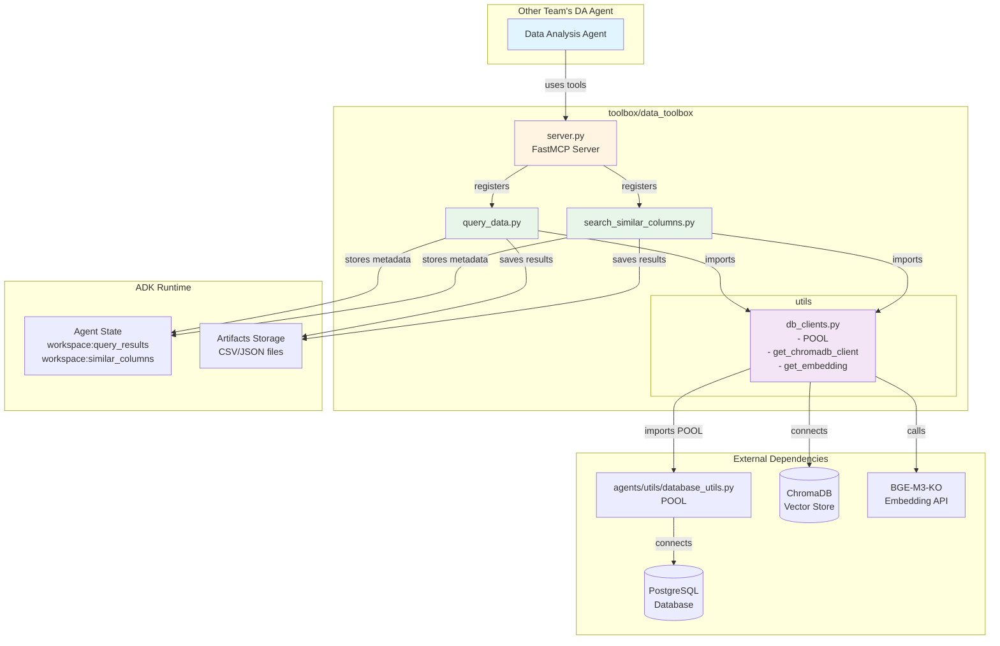
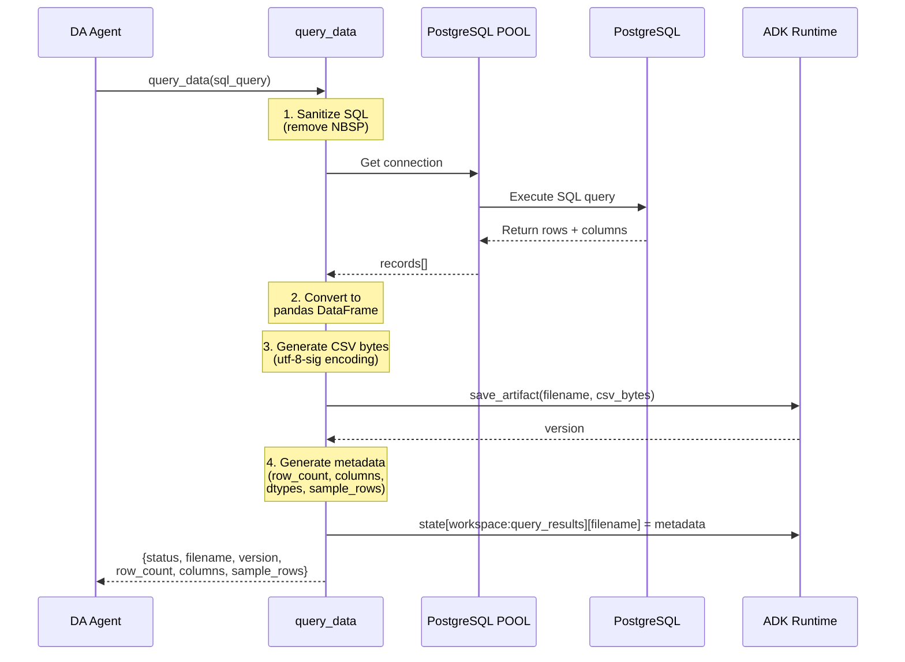
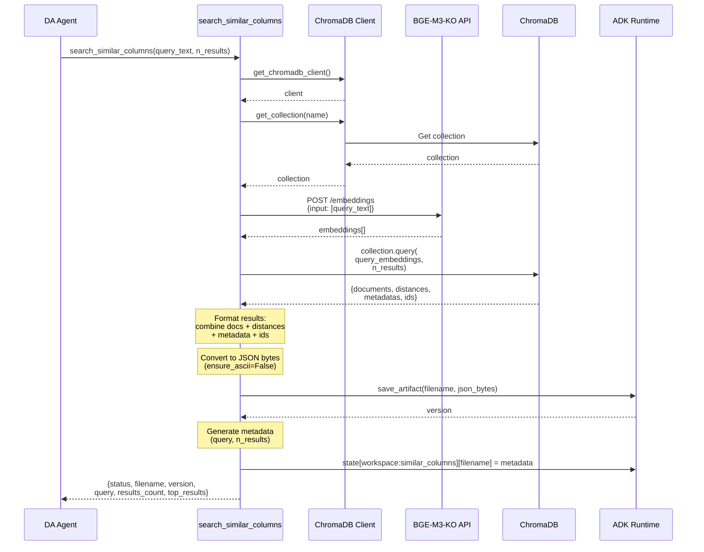
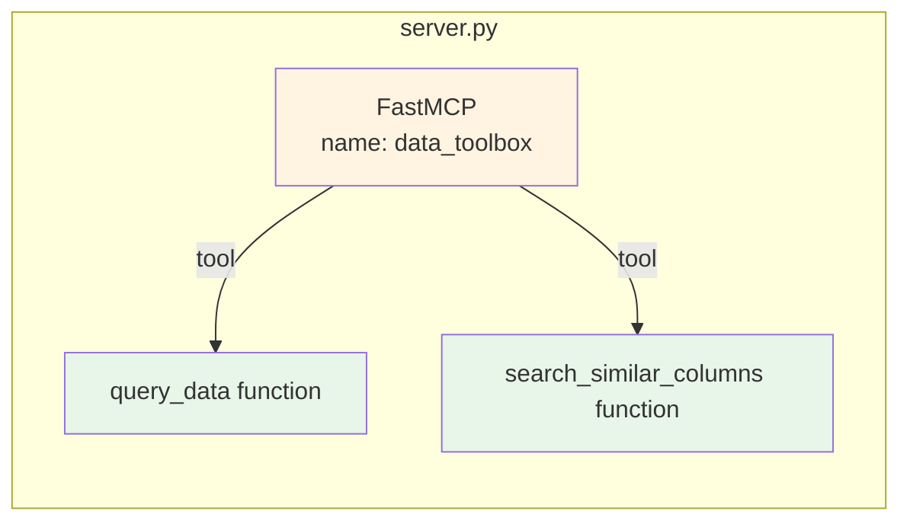
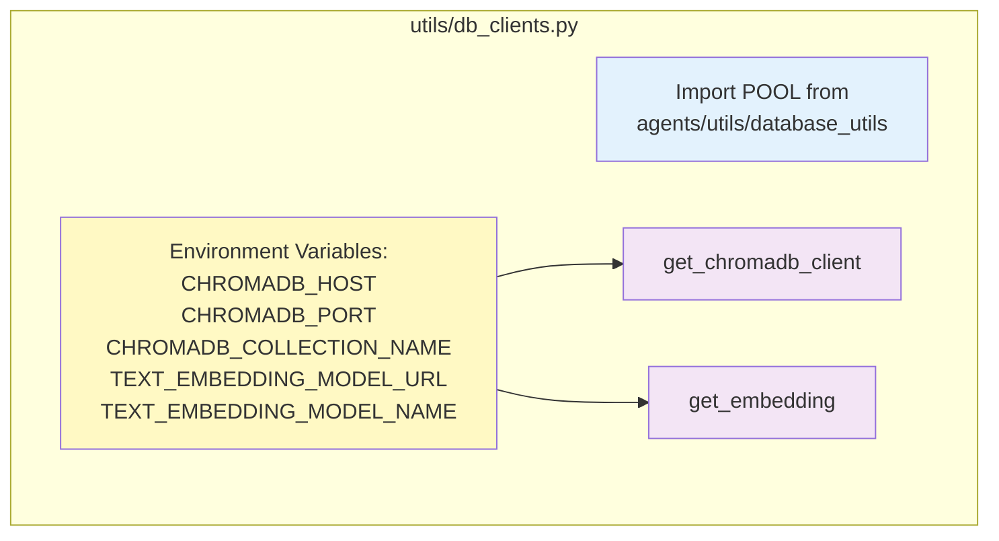
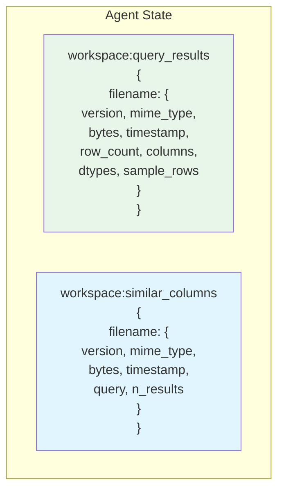

# Data Toolbox Architecture

## 1. Overall System Architecture



## 2. query_data Tool Flow



## 3. search_similar_columns Tool Flow



## 4. Component Details

### 4.1 FastMCP Server Registration



### 4.2 Database Clients Helper



### 4.3 State Management



## 5. Data Flow Summary

### query_data:
1. **Input**: SQL query string
2. **Process**:
   - Sanitize SQL (remove NBSP)
   - Execute via PostgreSQL POOL
   - Convert to pandas DataFrame
   - Generate CSV with utf-8-sig encoding
3. **Output**:
   - CSV artifact saved to ADK
   - Metadata stored in state
   - Returns summary with sample rows

### search_similar_columns:
1. **Input**: Natural language query text
2. **Process**:
   - Get embedding from BGE-M3-KO API
   - Query ChromaDB with vector similarity
   - Combine results with metadata
   - Generate JSON with full results
3. **Output**:
   - JSON artifact saved to ADK
   - Metadata stored in state
   - Returns summary with top 3 results

## 6. Usage Example

```python
from toolbox.data_toolbox import data_toolbox
from google.adk import Agent

# Create DA agent with data_toolbox
agent = Agent(
    name="data_analysis_agent",
    tools=[data_toolbox],
    model="gemini-2.0-flash-exp",
)

# The agent can now use:
# - query_data(sql_query, artifact_filename)
# - search_similar_columns(query_text, n_results, artifact_filename)
```

## 7. Key Design Decisions

1. **POOL Reuse**: Import existing PostgreSQL connection pool to avoid duplicate connections
2. **ADK Artifacts**: Save all results as artifacts (CSV/JSON) for persistence and sharing
3. **State Metadata**: Store file metadata in agent state for tracking and discovery
4. **FastMCP Pattern**: Follow existing toolbox pattern (plot_toolbox) for consistency
5. **No Metadata Tool**: Removed get_column_metadata as metadata was reference-only
6. **All in data_toolbox**: Centralized location for easy import by other teams
