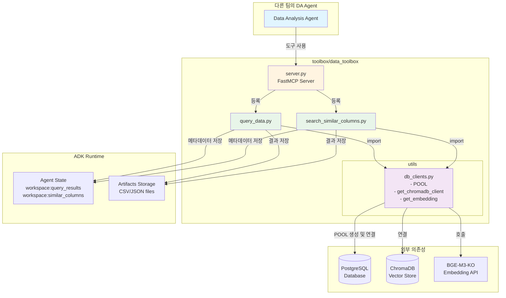
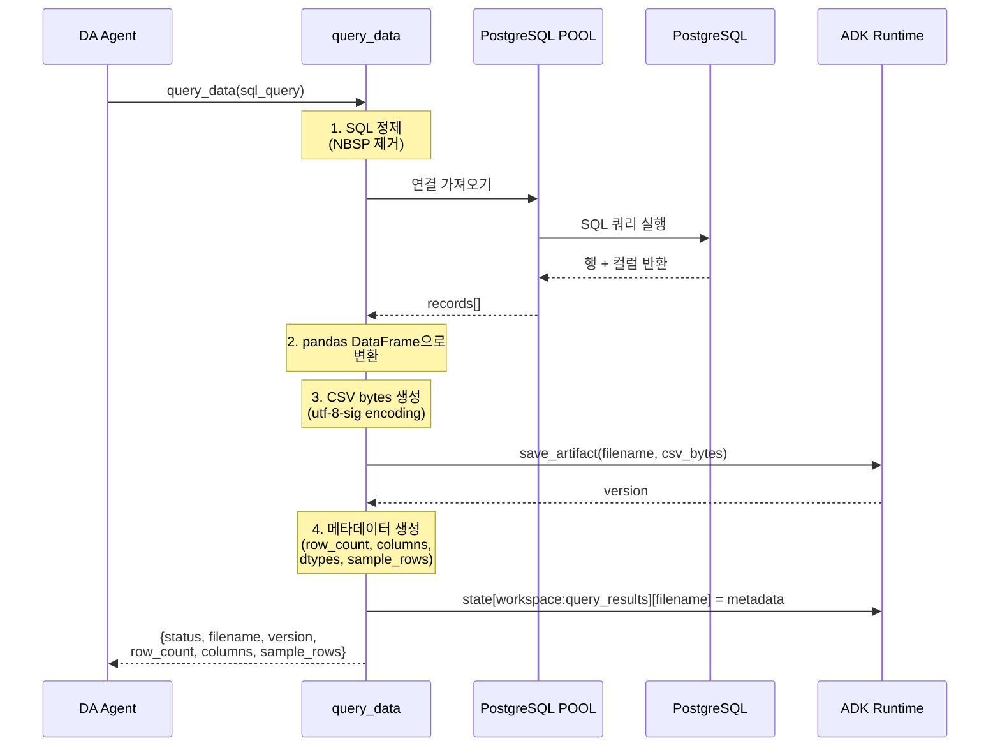
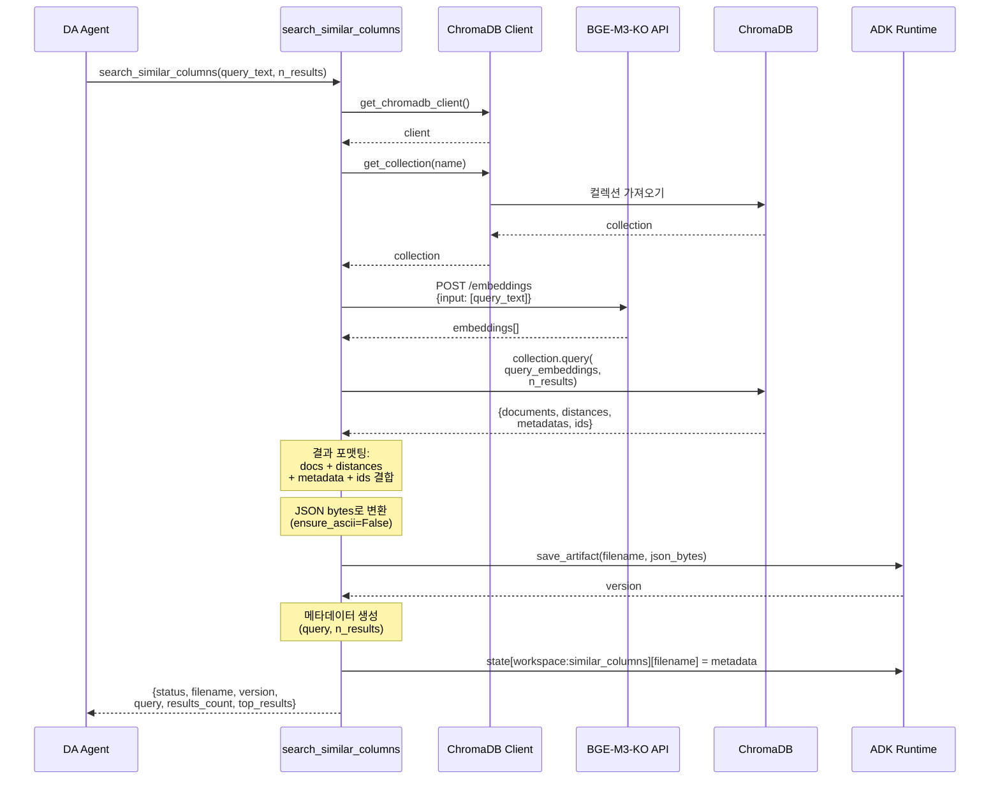
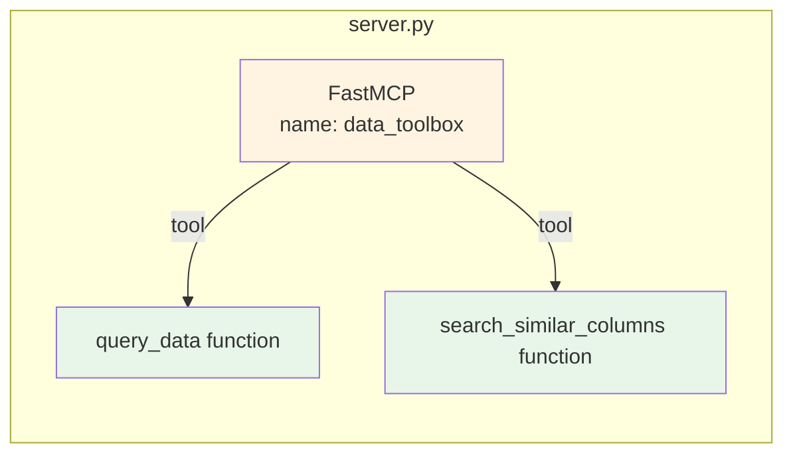
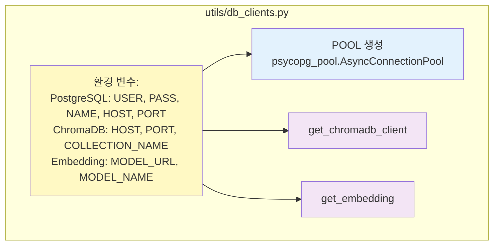
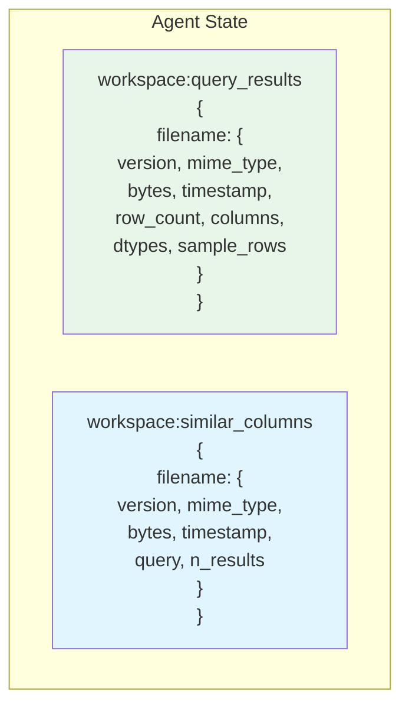

# Data Toolbox 아키텍처

## 1. 전체 시스템 아키텍처



## 2. query_data Tool 흐름



## 3. search_similar_columns Tool 흐름



## 4. 컴포넌트 세부사항

### 4.1 FastMCP 서버 등록



### 4.2 Database Clients 헬퍼



### 4.3 State 관리



## 5. 데이터 흐름 요약

### query_data:
1. **입력**: SQL 쿼리 문자열
2. **처리**:
   - SQL 정제 (NBSP 제거)
   - PostgreSQL POOL을 통해 실행
   - pandas DataFrame으로 변환
   - utf-8-sig 인코딩으로 CSV 생성
3. **출력**:
   - ADK에 CSV artifact 저장
   - State에 메타데이터 저장
   - 샘플 행과 함께 요약 반환

### search_similar_columns:
1. **입력**: 자연어 검색 텍스트
2. **처리**:
   - BGE-M3-KO API에서 임베딩 가져오기
   - ChromaDB에서 벡터 유사도 검색
   - 결과와 메타데이터 결합
   - 전체 결과를 JSON으로 생성
3. **출력**:
   - ADK에 JSON artifact 저장
   - State에 메타데이터 저장
   - 상위 3개 결과와 함께 요약 반환

## 6. 사용 예제

```python
from toolbox.data_toolbox import data_toolbox
from google.adk import Agent

# data_toolbox를 사용하는 DA agent 생성
agent = Agent(
    name="data_analysis_agent",
    tools=[data_toolbox],
    model="gemini-2.0-flash-exp",
)

# agent는 이제 다음 도구들을 사용할 수 있습니다:
# - query_data(sql_query, artifact_filename)
# - search_similar_columns(query_text, n_results, artifact_filename)
```

## 7. 주요 설계 결정사항

1. **독립적인 POOL 관리**: data_toolbox 내부에서 자체 PostgreSQL 연결 풀을 생성 및 관리
2. **ADK Artifacts**: 모든 결과를 artifact (CSV/JSON)로 저장하여 영속성과 공유 지원
3. **State 메타데이터**: 파일 메타데이터를 agent state에 저장하여 추적 및 검색 가능
4. **FastMCP 패턴**: 일관성을 위해 기존 toolbox 패턴(plot_toolbox) 따름
5. **Metadata Tool 제거**: get_column_metadata는 참고용이었으므로 제거
6. **data_toolbox 통합**: 다른 팀이 쉽게 import할 수 있도록 중앙화된 위치에 배치
7. **환경 변수 기반 설정**: PostgreSQL, ChromaDB, Embedding API 모두 환경 변수로 설정 관리
